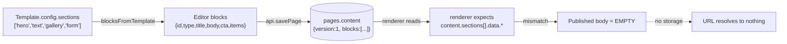

# KleeLab — Full Audit & Remediation Plan

**Date:** 2026-09-12
**Scope audited:** `kleelab-frontend` (Next.js 14), `kleelab-backend` (FastAPI), `render.yaml`, migrations.
**Decisions locked:**
- Target: **full freeform visual builder** (nested elements, drag anything anywhere, per-element styling).
- **D1 Builder engine:** `@dnd-kit` + a custom Zustand tree store.
- **D2 Publish model:** Next.js renders from the schema via a shared component registry.
- **D3 Brand:** the light editorial theme (`#f6f7f2` / `#17231c` / `#e25d3f`, serif headings) becomes the single design system.
- **D4 Backend:** keep and repair (targeted fixes, no rewrite).
- **D5:** templates become full canonical documents.

Audit-first was completed before any code changes.

> This document is a planning artifact only. It is not coupled code; the two projects remain independent.

---

## 1. Executive Summary

The repository contains **two disconnected half-products** rather than the single roadmap in the master plan:

1. A **backend that is genuinely good** — FastAPI, async SQLAlchemy, JWT/bcrypt auth, rate limiting, structured errors, 11 routers, 10 models, services for email/SEO/GDPR/analytics. It is *ahead* of the plan in places (products, orders, analytics exist → Phase 4 data layer) and *behind* in others (no Stripe/subscriptions, no asset upload, no real publishing).
2. A **frontend that is one page** — `/` renders a single `BuilderWorkspace` component. There is **no marketing site (Phase 2)**, no builder routing, and **no drag-and-drop at all**.

The specific complaint — *"all the drag and drop for users to create simple sites didn't work"* — is accurate and has **three independent causes**, none of which is a bug in the editor code itself:

| # | Cause | Evidence |
|---|-------|----------|
| **C1** | **No drag-and-drop engine exists.** Reordering is up/down arrow buttons; adding appends to the end. | `package.json` has no DnD lib; `BuilderWorkspace.moveBlock(±1)`; `EditorCanvas` "Add section" |
| **C2** | **The content model cannot represent layout.** Blocks are a *flat array of fixed typed sections* with hardcoded fields — no nesting, no columns, no per-element styling. | `types/api.ts` `BuilderBlock`; `EditorCanvas.BlockPreview` |
| **C3** | **The editor and the renderer speak different schemas, and publishing discards its output.** The editor saves `content.blocks`; the renderer reads `content.sections`. Publish writes to a temp dir that is deleted, with upload explicitly a stub. | `api.savePage`; `services/renderer.py`; `routers/sites.py` |

So even a perfect drag-and-drop editor would today produce sites that **render blank and publish nowhere**.

**Recommendation:** keep the backend (targeted repair, not rewrite), and **rebuild the editor front end around a canonical, versioned document schema** that is consumed by *both* the editor canvas and the published site. This is the single change that makes drag-and-drop meaningful and makes the publish pipeline disappear as a class of bug.

---

## 2. Repository & Deployment Map

```
kleelab-dev/
├── KLEELAB-AUDIT-AND-REMEDIATION.md   ← this document
├── render.yaml                        ← deploys BACKEND + Postgres only
├── graphify-out/                      ← code knowledge-graph cache (tooling)
├── kleelab-backend/                   ← FastAPI (Python 3.12)
└── kleelab-frontend/                  ← Next.js 14 App Router (TS)
```

**Findings**

| ID | Severity | Finding |
|----|----------|---------|
| **F0.1** | P2 | `render.yaml` deploys **only** `kleelab-api` + `kleelab-db`. There is **no frontend deployment target**. The site has no home in production. |
| **F0.2** | P2 | No CI workflow, no test suite anywhere (backend or frontend). `npm run build` / `pytest` are never gated. |
| **F0.3** | P2 | `graphify-out/` is committed cache (AST hashes). Harmless but should be git-ignored if not intentionally versioned. |
| **F0.4** | ✅ Resolved | `next@14.2.35` carried a critical vulnerability cluster (unauthenticated RCE, Image Optimizer RCE, SSRF, cache poisoning, DoS) plus a high `glob` advisory. **Upgraded to `next@16.3.5` / `react@19.3.0`; `npm audit` now reports 0 vulnerabilities.** See the R0.6 log entry. |
| **F0.5** | ✅ Resolved | `.env` and `.env.local` **are** correctly listed in the root `.gitignore`, so they are not committed. No action needed. |

---

## 3. Frontend Audit

### 3.1 Routing — almost nothing is reachable

`src/app/` contains only `layout.tsx`, `page.tsx`, `globals.css`.

| Planned route | Exists? |
|---------------|---------|
| `/` (agency home per plan) | ❌ — `/` is the builder, not the marketing site |
| `/services`, `/work`, `/work/[slug]`, `/about`, `/contact`, `/blog`, `/blog/[slug]` | ❌ |
| `/privacy`, `/terms`, `/cookies` | ❌ |
| `/builder/dashboard`, `/builder/new`, `/builder/[siteId]/edit`, `/preview`, `/settings`, `/analytics` | ❌ |
| Auth pages (`/login`, `/register`) | ❌ (auth is a modal inside the builder) |

| ID | Severity | Finding |
|----|----------|---------|
| **F1.1** | **P0** | Phase 2 (agency site) is **entirely absent**. The production app is a blank editor with no nav, no footer, no home. |
| **F1.2** | P1 | No builder routes — the whole experience is a 3-step wizard (`welcome → templates → editor`) in one component. There are no deep links, no shareable URLs, no way to resume editing a specific site by URL. |
| **F1.3** | P2 | `Sidebar.tsx` and `components/tabs/{Overview,Pages,Sites,Products,Analytics,Templates}Tab.tsx` are **dead code** — imported nowhere. They belong to a dashboard that was never routed. |

### 3.2 The builder implementation

| ID | Severity | Finding |
|----|----------|---------|
| **F2.1** | **P0** | **No drag-and-drop library.** `moveBlock(direction: -1 \| 1)` swaps array positions; `addBlock` appends. Users cannot drag a block, cannot drop between blocks, cannot reorder by pointer, cannot nest. This is the headline failure. |
| **F2.2** | **P0** | **Flat, fixed block model.** `BuilderBlock` = `{id, type, eyebrow?, title?, body?, cta?, image_url?, items?}` with 6 types. No children, no containers/columns, no style object, no spacing, no alignment, no per-element typography. Freeform layout is impossible on this model. |
| **F2.3** | **P0** | **No image upload.** `image_url` exists on the type but there is **no input control** for it, and the backend has **no upload endpoint** (see F4.4). Images cannot be added at all. |
| **F2.4** | P1 | **Preview is fake.** `openPreview()` builds a hand-written HTML string for a 3-type subset inside `window.open` (and requires pop-ups). It does not use the real renderer, so it cannot be trusted as WYSIWYG. |
| **F2.5** | P1 | **Templates don't change design.** Picking a template only seeds the initial block list (`blocksFromTemplate`). The canvas chrome is a hardcoded `north / studio` nav. Every published site would look the same regardless of template. |
| **F2.6** | P2 | Undo/redo is capped at 20 steps (`slice(-19)`) and lives in local component state (lost on reload/site switch). Plan asked for 50. |
| **F2.7** | P2 | Autosave (700 ms debounce + signature compare in `lastSavedRef`) is actually **reasonable** — keep this pattern. But there is no conflict detection across tabs (plan asked for it). |
| **F2.8** | P2 | `api.ts` exposes only 10 methods (auth, templates, sites, pages). Backend routers for **products, orders, analytics, dashboard, versions, seo, gdpr, assets** are **unreachable from the UI**. |

### 3.3 Brand & design system — three conflicting identities

This is a significant, under-reported problem.

| Source | Identity |
|--------|----------|
| **Master plan** | 🍀 Clover Green `#4CAF50`, Lucky Gold `#FFD700`, Soft Mint `#E8F5E9`, Charcoal `#1a1a1a`; **Poppins** headings, **Inter** body; "cute, secure digital products" |
| `layout.tsx` + `globals.css` + `tailwind.config.js` | **Dark slate-950** "Control Center", blue `brand` palette, dark gradient body, Inter only |
| `BuilderWorkspace.tsx` + `EditorCanvas.tsx` | **Light editorial** `#f6f7f2` / `#17231c` / orange `#e25d3f`, `font-serif` headings, all colors **hardcoded hex** |

| ID | Severity | Finding |
|----|----------|---------|
| **F3.1** | **P1** | The plan's brand (clover green / Poppins) appears **nowhere** in code. |
| **F3.2** | P1 | The Tailwind theme is **largely bypassed** — the builder uses raw hex literals (and `font-serif`), so `tailwind.config.js` tokens have almost no effect. No single source of truth for color/spacing/typography. |
| **F3.3** | P2 | Root `metadata` says *"KleeLab Control Center / Enterprise Digital Site Builder & E-Commerce Management Platform"* — contradicts the agency positioning *"We build cute, secure digital products."* |
| **F3.4** | P2 | `<html className="dark">` is hard-set globally, so dark mode is not actually toggleable despite `darkMode: 'class'`. |

---

## 4. Backend Audit

### 4.1 What's good (keep it)

- Clean layering: `core/` (config, database, security, logging, exceptions, rate limiter), `models/`, `schemas/`, `routers/`, `services/`.
- Async SQLAlchemy 2.0 + asyncpg; Alembic migrations present (`initial_schema`, `add_user_account_fields`).
- Auth: bcrypt with a correct 72-byte guard (`security.py`), JWT via python-jose, `get_current_user` ownership checks, email-verify + password-reset signed tokens.
- Ownership verification helpers (`get_owned_site/page/order/product`) are applied consistently — **good IDOR posture**.
- Page versioning with 50-version trim (`routers/pages.py update_page`).
- Sentry hook, request logging, structured error envelope.

### 4.2 Findings

| ID | Severity | Finding |
|----|----------|---------|
| **F4.1** | **P0** | **Duplicate, conflicting render service.** `services/renderer.py` and `services/static_generator.py` both define `generate_static_site`. `routers/sites.py` imports the **renderer** one; `static_generator.py` is **dead code**. Two implementations of the same contract invite silent divergence. |
| **F4.2** | **P0** | **Publishing produces no artifact.** `renderer.generate_static_site` writes files into `TemporaryDirectory(...)` which is **destroyed on exit**; the upload step is an explicit stub. `static_generator` repeats the same pattern. `publish` returns a `*.kleelab.com` URL that **resolves to nothing**. |
| **F4.3** | **P0** | **No publishing infrastructure.** No object storage (S3/R2), no CDN, no reverse-proxy/wildcard-DNS config, no SSL automation. "Subdomain hosting / custom domain / SSL" from the plan are **pure stubs** (`set_custom_domain` just stores a string). |
| **F4.4** | **P1** | **No assets/upload router** although the `Asset` model + `assets` table exist. Combined with F2.3, images are impossible end-to-end. |
| **F4.5** | **P1** | **No subscriptions/Stripe.** No router, no model, no webhook. `Subscription` exists only as a fictional frontend type. Phase 3/4 billing is absent. |
| **F4.6** | **P1** | **Rate limiter is in-memory per-process** (`core/rate_limiter.py`). On Render with >1 worker/instance it is trivially bypassed and inconsistent; the cleanup loop only removes *empty* deques. Needs Redis (or a managed limiter). |
| **F4.7** | **P1** | **Token model does not match the plan.** `ACCESS_TOKEN_EXPIRE_MINUTES = 1440` (24 h) with **no refresh token** and **no refresh endpoint**; no `logout` endpoint (client just deletes the token); no Google OAuth; no `/forgot-password` alias. Plan specified 15 min + refresh rotation. |
| **F4.8** | P1 | **Publish is gated on `is_verified`, but `AUTO_VERIFY_EMAILS` defaults to `False`.** In the live environment publishing succeeded for a freshly registered account, so the flag is evidently enabled there — which means the gate is currently masked by configuration. A deployment that forgets it would silently block all publishing. Keep, but make the state visible to the user. |
| **F4.9** | P2 | **`tally.py` router missing.** Phase 1 waitlist integration is not present in the backend. |
| **F4.10** | P2 | `bcrypt==5.0.0` pinned in `requirements.txt`, but `bcrypt` 4.x/5.x had breaking API churn around `gensalt`/pure-python behaviour across environments — verify the pin builds on the Render Python 3.12.8 image. (`sentry-sdk==2.0.0` is also old.) |
| **F4.11** | P2 | `templates` uses `sa.JSON` (not JSONB) and `config` is an unvalidated `dict`; there is no schema for `config`. Combined with F5.x this is where template/section drift hides. |
| **F4.12** | P2 | No security headers (CSP, HSTS, X-Frame-Options). Plan listed these. |
| **F4.13** | P2 | `analytics_events` has no repository layer / retention policy and the table has no index on `(site_id, created_at)` — fine now, but plan called for Redis caching + query optimisation. |

---

## 5. The Critical Contract Break (root cause deep-dive)

The editor and the renderer describe content in **two incompatible languages**, and templates describe it in a **third**.



| Layer | Field it reads/writes | Shape |
|-------|----------------------|-------|
| Frontend save (`api.savePage`) | `page.content_json` → backend `content` | `{ version: 1, blocks: [{id,type,eyebrow,title,body,cta,items}] }` |
| Backend renderer (`services/renderer.py`) | `page.content` | `{"sections": [{type, data: {title, subtitle, text, html, images}}]}` |
| Template seed (`services/template_seed.py`) | `template.config` | `{sections: [...], colors, fonts, layout, category}` |

**Consequences**
- `render_section` is only ever reached if `content["sections"]` exists — it never does → **empty `<body>`**.
- `renderer.render_page` also passes `page.og_title / meta_title / meta_description`, which exist, so the `<head>` is fine — masking the fact the body is empty.
- `template_config.get("styles")` is always `""` because the seed has no `styles` key → **no template CSS**.

| ID | Severity |
|----|----------|
| **F5.1** | **P0** — Editor→DB→renderer schema mismatch; published sites render empty. |
| **F5.2** | **P0** — Publish output is discarded (temp dir) and never uploaded. |
| **F5.3** | P1 — Template `config` has no schema; `styles` referenced but never provided; template design is not applied. |

---

## 6. Schema Drift — DB/Model vs Frontend Types

The frontend `types/api.ts` describes a **different backend** than the one that exists. These fictional types are used only by the dead tab components.

| Entity | DB / Model / Schema (truth) | Frontend type (fiction) | Drift |
|--------|----------------------------|-------------------------|-------|
| Asset | `filename`, `file_type`, `url`, `file_size` | `file_name`, `file_url`, `mime_type` | ❌ names differ |
| Product | `price`, `stock`, `images`, `category`, `variants` (no currency) | `price`, `currency`, `inventory_count` | ❌ `stock`→`inventory_count`, phantom `currency` |
| Order | `total`, `items`, `customer_name` (no currency/count) | `total_amount`, `currency`, `items_count` | ❌ all three differ |
| Template | `name`, `preview_image`, `thumbnail`, `config` | `title`, `description`, `thumbnail_url` | ⚠️ patched by `normalizeTemplate` at runtime |
| Subscription | **does not exist** | fully typed | ❌ phantom |
| `DashboardStats`, `ActivityItem`, `TabType` | partial backends | fully typed | ❌ phantom |

| ID | Severity | Finding |
|----|----------|---------|
| **F6.1** | P1 | Frontend types are hand-maintained and **already wrong**. No generation from OpenAPI → drift will keep recurring. |
| **F6.2** | P2 | `normalizePage`/`normalizeTemplate` in `api.ts` are runtime patches masking contract mismatches rather than fixing them. |

---

## 7. Plan vs Reality Scorecard

| Plan item | Status | Note |
|-----------|--------|------|
| Phase 1 Foundation (waitlist, Tally, coming-soon) | ⚠️ unknown | No Tally router; no marketing page; no video assets found in the tree |
| Phase 2 Agency site (11 routes, 12 components) | ✅ | Built in R5 - 11 routes, 12 components, public leads endpoint |
| Phase 3 Backend | 🟡 ~70% | Strong base; publishing broken; no Stripe; token model short of spec |
| Phase 3 Builder frontend | 🔴 ~15% | One page, no routes, **no DnD**, no images, no template design |
| Phase 4 E-commerce | 🟡 money path correct | Order intake rewritten in R6.1 (server-computed totals, public intake, race-safe stock). No payment provider (see D6); storefront UI still to come |
| Phase 5 Polish & Launch | ❌ | No tests, no CI, no perf/security work, no frontend deploy |
| **Extra (unplanned)** | ✅ | products/orders/analytics/versions/gdpr/dashboard backends; 6 dead dashboard tabs |

---

## 8. Remediation Plan

**Guiding principle:** *one canonical document schema, consumed by both the editor and the published renderer.* This is the keystone; without it the editor is rebuilt twice.

### R0 — Foundations & Cleanup  *(no user-facing features)*
- **R0.1** Delete dead code: `services/static_generator.py`; decide fate of `Sidebar.tsx` + `components/tabs/*`.
- **R0.2** Encode the **light editorial theme** (decided, D3) as the single source of truth: Tailwind theme + CSS variables + a font decision (serif headings). Remove hardcoded hex from components. Align `layout.tsx`, `globals.css`, `tailwind.config.js` to it and drop the dark "Control Center" remnants.
- **R0.3** Add frontend tooling: `zustand`, `@dnd-kit/core` + `@dnd-kit/sortable`, `zod` for schema validation.
- **R0.4** Generate TS types from the backend OpenAPI schema (kills §6 drift permanently).
- **R0.5** Add minimal CI: backend `ruff` + `pytest` smoke, frontend `tsc --noEmit` + `next build`.
- **Acceptance:** `npm run build` and backend import/health tests pass in CI; no hex literals in components; dead files removed.

### R1 — Canonical Document Schema + Rendering Pipeline  *(the keystone)*
- **R1.1** Define `schemaVersion` document model (shared JSON schema, validated with `zod` in TS and Pydantic on the server):
  ```
  Document = { schemaVersion, root: Node, tokens: {...} }
  Node     = { id, type, props, style, responsiveStyle?, children: Node[] }
  ```
  Element types: `page`, `section`, `container`, `grid`, `heading`, `text`, `image`, `button`, `link`, `divider`, `spacer`, `list`, `form`, `input`, `nav`, `footer`, `html`.
- **R1.2** Build a **single component registry** (`type → React component`) used by **both** the editor canvas and the published site. WYSIWYG becomes structural, not aspirational.
- **R1.3** Migrate `pages.content` to the new schema (Alembic data migration mapping legacy `blocks` and legacy `sections` → new tree).
- **R1.4** **Delete server-side rendering** (`services/renderer.py`) and serve published sites from Next.js using the shared registry (decided, D2). This removes the temp-dir/upload path and the duplicate-renderer problem (F4.1/F4.2) outright.
- **Acceptance:** a hand-authored JSON document renders identically in the editor canvas and on the published route.

### R2 — The Builder (main effort)
- **R2.1** Real routes: `/builder/dashboard`, `/builder/new`, `/builder/[siteId]/edit`, `/preview`, `/settings`.
- **R2.2** Zustand document store: tree ops, selection (single+multi), history (undo/redo ≥50), autosave, cross-tab conflict detection.
- **R2.3** **Nested drag-and-drop with `@dnd-kit`**: palette → canvas insert; drag to reorder; drop *into* containers; duplicate/delete; drag handle UX; keyboard-accessible reordering.
- **R2.4** Properties panel with real style controls: spacing, colour (token-aware), typography, alignment, size, border; **device-specific overrides** (desktop/tablet/mobile).
- **R2.5** Media manager backed by a new **assets upload router** + storage (closes F2.3/F4.4).
- **R2.6** Templates become full canonical documents (not section-name lists), so choosing one actually changes the design (closes F2.5).
- **Acceptance:** a user can build a multi-section page with nested containers, style each element per breakpoint, add images, and undo/redo reliably.

### R3 — Publishing That Works
- **R3.1** Publish model is decided (D2): render on demand via Next.js (route per subdomain/slug) + cache invalidation — eliminates F4.2/F4.3. Add a `/s/[subdomain]` path-based route first, subdomain routing second.
- **R3.2** Serving layer: wildcard subdomain (`*.kleelab.com`) via the frontend host; custom domain = DNS verification + host mapping (a real task, not a string field).
- **R3.3** SEO: per-page metadata, `sitemap.xml`, `robots.txt` served by the **rendering host** (the current backend `seo.py` sitemap has no HTML to point at).
- **R3.4** Analytics: emit events from the rendered page into the existing `analytics_events` table.
- **Acceptance:** clicking Publish yields a URL that actually loads the built site.

### R4 — Auth & Backend Alignment
- **R4.1** Token model to spec: 15-min access + **refresh rotation** + `logout` (revoke) + `/forgot-password` alias.
- **R4.2** Resolve the email-verification dead-end (F4.8): either wire Resend properly or gate publish behind a clearer, visible state.
- **R4.3** Redis-backed rate limiting (F4.6) and security headers (F4.12).
- **R4.4** Add `tally.py` if Phase 1 waitlist is still live.
- **Acceptance:** token refresh works; publish is reachable for a normal new user; limits survive multi-instance.

### R5 — Phase 2 Agency Site *(plan's own Phase 2)*
- Build the 11 marketing routes and 12 components per the master plan, on the **unified** design system from R0.2.
- Wire the contact form to a leads endpoint (the `agency_leads` table already exists but has **no router**).

### R6 — E-commerce & Launch *(plan's Phase 4/5)*
- Fix type drift for products/orders, build storefront blocks + checkout, add Stripe subscriptions/webhooks.
- Perf/security/launch work per plan Phase 5, now on a real CI/observability base.

### Suggested order & why
`R0 → R1 → R2 → R3` delivers the thing that "didn't work": a working, publishable drag-and-drop builder. `R4 → R5 → R6` then restore the original roadmap order on solid ground. Building R5 (marketing) first would repeat the original mistake of shipping surface before the engine.

### R0 Progress Log

**2026-09-12 — R0 complete**

| Task | Status | Notes |
|------|--------|-------|
| R0.1 Remove dead code | ✅ Done | Deleted `services/static_generator.py` (zero references; duplicate of `renderer.generate_static_site`) and the unrouted `components/Sidebar.tsx` + `components/tabs/*` (6 files). |
| R0.2 Brand source of truth | ✅ Done | `tailwind.config.js`, `globals.css`, and `layout.tsx` rewritten to the light editorial theme with named tokens (`paper`, `canvas`, `ink`, `muted`, `line`, `mint`, `accent`, `danger`, `success`) plus CSS variables. Dark "Control Center" remnants removed. Component-level hex sweep folded into R2 (see note). |
| R0.3 Tooling | ✅ Done | Added `zustand`, `@dnd-kit/core`, `@dnd-kit/sortable`, `@dnd-kit/utilities`, `zod`. |
| R0.4 Types from OpenAPI | ✅ Done | Backend schema dumped (38 endpoints) → `openapi.json` contract snapshot at the frontend root → `src/types/api.gen.ts` (73 KB) generated via the new `types:api` script. **Adoption** of the generated types (replacing the hand-written/fictional ones) happens in R1/R2. |
| R0.5 CI | ✅ Done | `.github/workflows/ci.yml` added: frontend `npm ci` → `lint` → `typecheck` → `build`; backend `pip install` → import smoke → `compileall`. All steps verified locally. |
| R0.6 Next.js 16 upgrade | ✅ Done | `next@16.3.5`, `react`/`react-dom`@19.3.0, `@types/react(-dom)`@19, `eslint-config-next`@16, `eslint`@9. **`npm audit`: 0 vulnerabilities.** See details below. |

**R0.2 deferral note:** the hex-sweep in `BuilderWorkspace.tsx` / `EditorCanvas.tsx` was **deliberately deferred into R2**, because both components are replaced by the freeform rebuild. `EditorCanvas.tsx` also contains 2,291-character lines that fall outside safe single-edit boundaries. Sweeping colours out of files that are about to be deleted is wasted churn; the tokens are in place for R1/R2 to consume.

**Verification:** `npm run lint` (0 errors, 1 warning), `npm run typecheck` clean, `next build` passes, dev server serves `GET / 200`, backend import smoke prints 38 routes, `compileall` exit 0.

**R0.6 — Next.js 16 upgrade notes** (the F0.4 blocker, now cleared):
- Ran the upgrade **manually** rather than via the interactive codemod: every codemod migration was verified non-applicable (no `middleware.ts`, no `experimental.turbo` config, no `unstable_` APIs, no `experimental_ppr`).
- **`next lint` is removed in 16**, and the project had **no ESLint config at all** (so it never actually ran). Added `eslint.config.mjs` (flat config, `core-web-vitals` + `typescript`) and changed the script to `eslint .`.
- **`eslint@latest` resolved to v10, which `eslint-config-next`'s bundled `eslint-plugin-react` does not support yet** (crashed with `contextOrFilename.getFilename is not a function`). Pinned to `eslint@^9`.
- Fixed the one real lint error: `react-hooks/set-state-in-effect` flagged the mount effect in `BuilderWorkspace`; the template fetch now updates state inside promise callbacks (which also added an unmount-safety `active` guard).
- Next.js auto-adjusted `tsconfig.json` (`jsx: react-jsx`, `target: ES2017`, `.next/dev/types` include).
- Added `turbopack.root` to `next.config.mjs` — Next had inferred the workspace root outside the repo (it warned about `~/pnpm-lock.yaml`).
- Next 16 now auto-generates `AGENTS.md` + `CLAUDE.md` (agent docs); kept them, since `next dev` re-creates them and the official guide recommends the setup.
- **Remaining lint warning (deliberate):** `@next/next/no-img-element` on the template thumbnail in `BuilderWorkspace` (line ~496). Template thumbnails are arbitrary remote URLs; `next/image` would require widening `images.remotePatterns` to all hosts. Resolved by R2's media manager.
- **R3 implications:** host routing must be written as `proxy.ts` (not `middleware.ts`; Node runtime only), request APIs (`params`/`searchParams`/`cookies`) are async-only, and cache invalidation now uses `revalidateTag(tag, profile)` / `updateTag`.

**R0 incidentally resolved:** F0.5 (env files are properly git-ignored).

### R1 Progress Log

**2026-09-12 — R1 core complete**

| Task | Status | Notes |
|------|--------|-------|
| R1.1 Canonical schema | ✅ Done | Frontend `src/lib/document.ts`: zod `documentSchema`/`nodeSchema`, `Style` token model, factories, `parseDocument`. Backend `schemas/document.py` mirrors it and is enforced on page create/update **only when `content.document` is present** (422 otherwise), so legacy writes still work. |
| R1.2 Shared registry | ✅ Done | `src/components/render/registry.tsx` — one `NODE_REGISTRY` covering all 17 node types, plus `NodeRenderer`/`DocumentRenderer`. A client component (event handlers) that still server-renders for SEO. |
| R1.3 Data migration | 🔀 **Re-sequenced into R2** | Migrating data before the *writer* changes is pointless — the editor still writes legacy `blocks`. Instead the renderer does a non-destructive **read-time** migration (`parseDocument`), so both shapes work today. The Alembic backfill + dropping legacy keys moves to R2, when the editor starts writing documents. |
| R1.4 Delete server renderer | ✅ Done | `services/static_generator.py` (R0) and `services/renderer.py` (R1) are both gone. `publish_site` no longer generates anything: it marks the site published and returns a real frontend URL (`{FRONTEND_URL}/s/{subdomain}`). |
| R1.5 Public read API | ✅ Done (added) | New `routers/public.py`: `GET /api/public/sites/{subdomain}` and `.../page?slug=` — published sites only. API went 38 → 40 routes. |
| R1.6 Published route | ✅ Done | `src/app/s/[subdomain]/[[...slug]]/page.tsx` — dynamic, rendered through the shared registry, with `generateMetadata` from the SEO fields. |

**Verification:** lint 0 errors · build routes `/`, `/_not-found`, `ƒ /s/[subdomain]/[[...slug]]` · typecheck clean · backend import 40 routes, `compileall` 0. The schema, migrator, and style resolver were exercised at runtime with a throwaway Node script: legacy `blocks` (hero/features/contact) and legacy `sections` (hero/gallery) both convert correctly, responsive overrides resolve (`max-md:text-center max-md:py-4`), and invalid documents are rejected.

**Not yet proven end-to-end:** rendering a live published page needs a running database (no DB/fixtures in this environment). Belongs to R3 verification.

**Editor adoption:** the canvas still edits legacy `blocks`. R2 rewires it onto the document model and deletes the legacy path.

### Cleanup, Responsive Editor & R3 Routing (2026-09-12)

| Item | Result |
|------|--------|
| Trim superseded editor | `BuilderWorkspace` rewritten as pure onboarding (site picker + template chooser); `EditorCanvas.tsx` **deleted**; every hardcoded hex replaced with design tokens. **Lint is now completely clean (0 problems).** |
| Responsive editor | `Palette`/`Inspector` accept a `className`; the shell adds a mobile panel switcher and drawer, so both are reachable below `lg`/`xl` instead of being unreachable. |
| Host routing | New `src/proxy.ts` (Next 16's renamed middleware): `{sub}.kleelab.com` → `/s/{sub}`; custom domains resolved through `GET /api/public/resolve` with a 60 s cache. |
| Sitemap / robots | Per-site `robots.txt` and `sitemap.xml` route handlers; an app-level `robots.ts` disallows `/builder` and `/api`. |
| Cache invalidation | **Deliberately not added.** Published pages render with `cache: 'no-store'`, so content is always fresh and there is nothing to invalidate. Tag-based caching is the optimisation path once traffic justifies it (`revalidateTag(tag, 'max')` / `updateTag`). |

**Verified by spoofing `Host` headers against the running stack:**
- `Host: {sub}.kleelab.com` → 200 serving the published site (subdomain rewrite)
- `Host: {custom-domain}` → 200 serving the published site (resolution via the API)
- `/s/{sub}/robots.txt` → 200 with the `Sitemap:` line
- `/s/{sub}/sitemap.xml` → 200, valid XML listing both pages

> `next build` prints the sitemap route as `/s/-/sitemap.xml`. That is Next's placeholder for a dynamic metadata route — the live path and output are correct.

The frontend `Asset` type (previously fictional — `file_name`/`file_url`/`mime_type`) now matches the backend `AssetOut`.

### R2 Progress Log

**2026-09-12 — R2 core (drag-and-drop editor) working**

| Task | Status | Notes |
|------|--------|-------|
| R2.2 Document store | ✅ Done | `src/lib/editor/tree.ts` (immutable tree ops: find/insert/move/remove/clone, self-descendant guard) + `src/lib/editor/store.ts` (Zustand: document, selection, 50-step history, device, per-breakpoint style targets). |
| R2.3 Nested drag-and-drop | ✅ Core done | `@dnd-kit` with a palette (13 blocks) and a recursive sortable canvas. Custom collision detection (pointer-based, deepest-node preference) plus edge-aware `before / after / inside` placement. |
| R2.4 Properties panel | ✅ Done | `Inspector.tsx`: per-type content controls (heading/text/button/link/image/list/spacer/nav/footer) and layout tokens (background, colour, align, size, padding, gap, radius, shadow, max-width) targeting **all / tablet / mobile**. |
| R2.1 Real routes | ✅ Done | `/builder/dashboard` (sites list, publish/unpublish, open editor, settings, delete, sign out), `/builder/new` (template onboarding), `/builder/[siteId]/settings` (name, subdomain, custom domain, per-page SEO, publish, delete). Editor + settings reachable from the dashboard; editor toolbar links back to it. |
| R2.5 Media manager + assets upload | ✅ Done (provider pending) | Cloudinary chosen. New `routers/assets.py` (list/upload/delete; uploads are JSON data-URLs, avoiding a multipart dependency), `services/storage.py` (signed REST upload using only the standard library), `schemas/asset.py`. The inspector gained an image picker with an upload control. Verified: list `200`, a valid image returns a clear **503** while `CLOUDINARY_URL` is unset, and a bad type returns **422**. **A real upload stays unverified until credentials exist.** |
| R2.6 Templates as documents | ✅ Done | `src/lib/templates.ts` builds a full canonical document per template category (`config.document` wins when a template record ships one). New sites are now seeded with a **document**, not legacy blocks. |
| Page switching | ✅ Done (added) | `PagesBar` + `openPage`/`createPage` in the editor. Switching **flushes the pending autosave first**, so edits cannot be lost when changing pages. |

**The original complaint is now fixed:** drag-and-drop exists and works.

**Browser-verified** (real Chromium, real pointer events, DOM order asserted after each step):
- palette → canvas insert at a precise index (dropped a Divider on the heading's top edge → `H1,P,A` became `HR,H1,P,A`)
- moving an **existing** node before a target (`HR,H1,P,A` → `HR,A,H1,P`)
- **undo** reverts a move
- selection drives the inspector; device toggle renders
- build / lint / typecheck all green; routes `/`, `/_not-found`, `ƒ /builder/[siteId]/edit`, `ƒ /s/[subdomain]/[[...slug]]`

**Bug found and fixed during verification:** applying `closestCenter` alone resolved drops onto the page root whenever a node was dragged by its own handle (element-centre vs cursor), so moves silently did nothing. Replaced with pointer-based collision detection preferring the deepest droppable.

**Second bug found and fixed:** `api.updatePage` always sent a `content` key, so any metadata-only update (site settings, SEO) would have **overwritten the stored page document with `{}`**. Content is now only sent when explicitly supplied. This is exactly the class of silent data-loss the original editor/renderer mismatch caused.

**Routes after R2:** `/`, `/_not-found`, `○ /builder/dashboard`, `○ /builder/new`, `ƒ /builder/[siteId]/edit`, `ƒ /builder/[siteId]/settings`, `ƒ /s/[subdomain]/[[...slug]]`. Browser-verified: dashboard renders its signed-out state, `/builder/new` renders the template onboarding, and the editor shows the new `PAGES / Add page` bar alongside the palette.

**Known gaps**
- The palette and inspector are `lg:`/`xl:`-only, so narrow viewports show canvas alone. Needs a collapsible/mobile treatment.
- Autosave writes `{ document }` (the new format) — **now verified end-to-end, see below**.
- `BuilderWorkspace`'s old internal block editor is now unreachable (site open/creation navigate to the new editor); `EditorCanvas.tsx` is superseded and should be trimmed once the dashboard routes land.
- Form-field editing and image upload are still to come.

### End-to-End Verification (2026-09-12) — closes the earlier "unverified" gaps

The configured `DATABASE_URL` points at a **remote Neon instance** (`neondb`), already at migration head (`add_user_account_fields`) and seeded with 15 templates. No migration or seed was needed or run. The backend was started against it and the real stack driven with a browser.

| Step | Result |
|------|--------|
| Backend health | `{"status":"ok","database":"connected"}` |
| Register + login | 201 / 200 |
| Create site + page **with a canonical document** | 201 — the backend's Pydantic document validator accepted it |
| Editor loads the document from the database | heading and body rendered from stored content |
| Edit → autosave | persisted; confirmed by polling `content.document` (landed in ~4.3 s) |
| Reload the editor | content restored from the database, not local state |
| Publish | `is_published=true`, `published_at` set, returned `https://kleelab.com/s/{subdomain}` |
| Public route `/s/{subdomain}` | rendered the same document through the shared registry (heading + text + divider); `generateMetadata` produced `Home · {site} · KleeLab` |

All test data was removed afterwards (`DELETE /api/users/me`); row counts returned to their pre-test values (users 6, sites 4, pages 3).

**Environment findings worth keeping**
- **email-validator rejects special-use domains** (`.test`, `.example`, `.invalid`), so registration tests need a real TLD. This produced a 422 that looked like an application bug.
- **Remote-database latency is seconds, not milliseconds.** A fixed 2.5 s wait produced a *false negative* — the editor looked like it had failed to load. Verification must poll for a condition, never sleep a fixed amount.
- **PowerShell environment variables persist between commands.** A `$env:DATABASE_URL` set earlier for a CI smoke test leaked into a later command and silently redirected a database check to the wrong server.
- Starting the backend requires the `.env` value to be in effect; an environment override takes precedence and fails confusingly (`password authentication failed for user "ci"`).

---

### R4 Progress Log (2026-09-12)

| Task | Status | Notes |
|------|--------|-------|
| **R4.1** Token model | ✅ | 15-min access + rotating refresh + revoke |
| **R4.2** Email verification dead-end | ✅ | gate enforced end-to-end; link is now clickable |
| **R4.3** Rate limiting + security headers | ✅ | in-process verified; store outage degrades safely |
| **R4.4** `tally.py` | N/A | no waitlist UI exists in this codebase |

**R4.1 — implemented.** Access tokens are short-lived and carry an `iat` claim; refresh tokens are opaque, stored only as a SHA-256 hash, and **rotated on every use**. Reusing a spent refresh token is treated as theft: the whole token family for that user is revoked (`revoke_all_for_user`), which logs the attacker *and* the victim out rather than silently accepting the replay. Three new endpoints: `/refresh` (unauthenticated — the refresh token is the credential), `/logout` (revokes one family), `/logout-all` (revokes every session). `/verify-email` no longer requires a bearer token, since the emailed token already identifies the user — previously a brand-new user could not verify without logging in first.

**R4.3 — implemented.** The rate limiter now has an explicit `TRUST_PROXY` switch: behind a load balancer the old code read the *proxy's* address for every request, so all callers shared one bucket and the limit was both useless (one user could exhaust it for everyone) and trivially bypassed. It also prunes stale entries instead of leaking a deque per IP forever. An optional Redis store is selected automatically when `REDIS_URL` is set; otherwise it logs that limits are per-process, which is honest rather than silently wrong. Security headers registered as the outermost middleware; HSTS is deliberately withheld in development.

**Verification (browser, real stack, real Neon):**

```
{"loginStatus":200,"expiresIn":900,"accessTokenLifetimeSeconds":900,
 "protectedWithAccess":200,"refreshStatus":200,"gotNewPair":true,
 "refreshTokenChanged":true,"reuseOldStatus":401,"newTokenAfterReuseStatus":401,
 "logoutStatus":200,"afterLogoutStatus":401}
```

Rotation, replay detection with family revocation, and logout revocation all pass. The first run returned `expiresIn: 86400`; the cause was **not** the code default but `ACCESS_TOKEN_EXPIRE_MINUTES=1440` sitting in `.env`, which overrode it — and `accessTokenLifetimeSeconds` was `null` because `iat` was missing from the JWT. Both are fixed, and the lifetime is now asserted rather than assumed.

**Cloudinary upload — verified for the first time.** `CLOUDINARY_URL` is now configured, and a real upload returned **201** with a `res.cloudinary.com/.../image/png` URL, and the asset listed. Previously this path returned 503 and was unverified.

**Known gaps (deliberate, not oversights):**
- **`.env` overrides code defaults silently.** This cost real debugging time twice. Any future TTL/limit change must be made in `.env`, not just `config.py`.
- **Rows uploaded before `public_id` existed cannot be reclaimed** — their remote files are unreachable by the API. Only test data is affected (none remains).
- **No frontend deploy target.** `render.yaml` deploys the API only, which mattered less before publishing worked and matters more now.

Test users were removed with a scoped `DELETE` (`email LIKE '%@kleelabverify.dev'`) after first listing the matches; counts returned to baseline (users 6, sites 4, pages 3, assets 0, refresh_tokens 0, templates 15), confirming the `ON DELETE CASCADE` chain works.

**Release gate:** `eslint` 0 problems · `tsc --noEmit` clean · `next build` clean (all 11 routes) · backend `compileall` OK · import smoke OK (74 routes).

---

### R4 Gap Closure (2026-09-12)

The three gaps recorded above are now closed. All were verified against the real stack, not by inspection.

**1. Remote files are actually reclaimed.** Uploads never stored Cloudinary's `public_id`, so deleting an asset dropped the database row and left the file in the bucket forever — the row was the *only* reference to it. Added `assets.public_id` (migration `add_asset_public_id`), capture it on upload, and destroy the remote object after the database agrees the asset is gone. Wired into all three deletion paths, because asset rows disappear by cascade as well as by direct delete: the asset endpoint, **site deletion**, and **account erasure** (`delete_user_data`). Upload and destroy now share one signing helper instead of duplicating the signature logic.

Verified by URL, which is the only end-to-end proof: upload → `200`; delete the asset → **`404`** on the first probe. Deleting a whole site → **`404`**. A control asset left in place still returns `200`, so the `404`s are deletion rather than a broken check. Note the first attempt *looked* like a failure (`200` after delete) — that was Cloudinary's CDN serving the copy fetched **before** deletion. Never pre-fetch an asset whose deletion is being tested.

**2. The verification gate is enforced and passable.** Two independent defects hid the gate: `_send` returned nothing either way, so the API reported "verification email sent" while discarding the message, and the email contained a bare token with **no page to enter it into** — the gate could never be passed even in principle. `_send` now reports whether a provider accepted the message, `resend-verification` says "logged" instead of lying when none is configured, emails carry a `/verify-email?token=` link, and `AUTO_VERIFY_EMAILS` is now **`false`** in `.env` so the gate is exercised rather than masked.

```
{"registeredIsVerified":false,"publishWhileUnverified":403,
 "publishDetail":"Email verification required before publishing",
 "resendStatus":200,"resendBody":{"status":"verification_email_logged","delivered":false},
 "isVerifiedAfterLink":true,"publishAfterVerify":200,
 "otherUserPublishStatus":403}
```

Opening the emailed link shows "Email confirmed", publish then returns `200`, and a *second* unverified account still gets `403` — so verification is doing the work, not bypassed. Without `RESEND_API_KEY` the message is written to the server log **in development only** (the body holds single-use tokens); production logs the failure without the body.

**3. A store outage degrades instead of spamming.** The Redis path already fell back to in-process limits, but it attempted a fresh connection *and logged a full traceback on every request* while the store was unreachable. Added a circuit breaker (3 consecutive failures → skip for 30s), proven by pointing `REDIS_URL` at a dead port with no `redis` package installed:

```
WARNING Rate-limit store failed 3 times; falling back to in-process limits for 30s
```

After tripping, the tracebacks stop for the cooldown and **every request still returned its normal status** — register `201`, login `200`, publish `403`, resend `200`, upload `201`, deletes `204`. Limits degrade to per-process; the API never fails.

**Caught while fixing this:** excluding every `/api/auth/*` path from refresh meant `/api/auth/me` returned `401` instead of rotating. With access tokens now at 15 minutes, the dashboard would have broken every 15 minutes. The exclusion is now an explicit list of session-establishing calls.

**New route:** `/verify-email`.

---

### R5 Progress Log (2026-09-12) — Phase 2 agency site

| Task | Status | Notes |
|------|--------|-------|
| **R5.1** Agency leads endpoint | ✅ | `POST /api/agency/leads` — public, honeypot-protected |
| **R5.2** Marketing shell | ✅ | Route group `(marketing)`, header, footer |
| **R5.3** Design system | ✅ | Three type roles; the display face is a real typeface now |
| **R5.4** The 11 routes | ✅ | All prerendered |
| **R5.5** Contact form | ✅ | Verified end to end against the running stack |
| **R5.6** SEO | ✅ | Per-route metadata, `sitemap.xml`, `robots.txt` |

The product had **no public front door**: `/` rendered the builder's onboarding wizard, and the marketing site did not exist. `/` is now the agency home and the builder keeps its own routes (`/builder/new`, `/builder/dashboard`, `/builder/[siteId]/edit`) outside the marketing layout, so the two never fight over chrome. Nothing linked to `/` as the builder, so the move was safe.

**Routes (11):** `/` · `/services` · `/work` · `/work/[slug]` · `/about` · `/contact` · `/blog` · `/blog/[slug]` · `/privacy` · `/terms` · `/cookies`.

**Components (12):** `SiteHeader`, `SiteFooter`, `Hero`, `Section`, `SectionHeading`, `PageHeader`, `ServiceCard`, `WorkCard`, `PostCard`, `Statement`, `CallToAction`, `ContactForm` — plus `Prose`, `LegalPage`, `Logo` and `ArrowLink` as supporting pieces.

**Three type roles, replacing a system stack.** `font-serif` previously resolved to `ui-serif`/Georgia/Cambria, which means the brand rendered differently on every operating system — a genuine defect, not a preference. Display is now **Newsreader** (drawn for newspapers: legible large, warmer than a didone, which suits *cute*), body is Inter, and labels/eyebrows/metadata are **IBM Plex Mono**, echoing the measurement language of a design tool. Because the token is central, the builder and dashboard inherit the change for free.

**The hero is the thesis.** Rather than describe a builder, the page shows one: a canvas with heading, text and image blocks arriving in sequence, the first carrying the selection outline, drag handle and drop indicator. It is the most characteristic thing in the subject's world, and it could not be dropped into a different agency's site. It is CSS-only (no client JS), and sits at a 5fr/7fr asymmetric split rather than an even one.

**Verification (browser, real stack):**

```
POST /api/agency/leads       -> 201 {"status":"received"}, row stored
honeypot field filled        -> 201 {"status":"received"}, 0 rows stored
message shorter than 10      -> 422
email "not-an-email"         -> 422
layout 1440px / 390px        -> no horizontal overflow on either
hero grid                    -> 453px 635px  (5fr / 7fr as intended)
h1 font-family               -> Newsreader, "Newsreader Fallback", ui-serif, Georgia, serif
```

The honeypot answer is **deliberately identical** to a real submission: a bot that gets an error learns to adapt, so it gets a success it cannot distinguish. The row simply is not written.

**Content is placeholder, and marked as such.** Case studies, notes, and the contact details are invented — every file carries a header comment saying so, and the legal pages render a **visible draft notice on the page** rather than only in a code comment, because unreviewed legal text that looks finished is exactly the kind of thing that quietly ships. The legal drafts are grounded in what this codebase actually does (which data is stored, which processors are involved, the 15-minute token lifetime) but they are **not legal advice** and have not been reviewed.

**Two things deliberately not built.**
- **No client testimonials.** Inventing quotes and attributing them to named people is fabrication, which is worse than placeholder copy. The `Statement` component carries the studio's own line instead, and already accepts an `attribution` for when real quotes exist.
- **No stock photography.** Work cards use a wallpaper of the studio mark, which cannot be mistaken for a real screenshot of a real project.

**Caught during verification:** the running backend process predated the new router, so the contact form returned 404 while the code was correct and the import smoke test passed. A green import check only proves the code loads — a long-running dev server still needs restarting when routers are added.

---

### R6 Progress Log (2026-09-12) — e-commerce, part 1: the money path

R6 opened with an audit of the checkout code, and the finding was worse than "the UI is missing": **the e-commerce path was built on the wrong trust model.**

| ID | Severity | Finding |
|----|----------|---------|
| **F7.1** | **P0** | `POST /orders` accepted `total` **from the request body**. The buyer chose the price; nothing recomputed it from stored products. |
| **F7.2** | **P0** | Order creation depended on `get_current_user` **plus `verify_site_ownership`** — so only the *site owner* could create orders on their own site. A shopper could never order. |
| **F7.3** | **P0** | No public product or order API existed. `public.py` served documents only, so a storefront block had nothing to call. |
| **F7.4** | **P1** | Line items were `list[dict]` — never validated that a product existed, belonged to that site, was active, or was in stock. |
| **F7.5** | **P1** | No currency anywhere in the schema. A `Numeric(10,2)` with no currency is not interpretable. |
| **F7.6** | **P1** | Frontend `Product`/`Order` types were fiction (`inventory_count`, `total_amount`, `items_count`) — F6.1, now fixed. |

**What was built.** A public storefront router (`routers/storefront.py`):

- `GET /api/public/sites/{subdomain}/products` — active products of a **published** site. Exposes `in_stock`, not the raw count: shoppers need availability, competitors do not need inventory levels.
- `POST /api/public/sites/{subdomain}/orders` — the request body has **no price field at all**. The buyer chooses what and how many; the server decides what it costs.

Four decisions carry the weight:

1. **The total is computed, never received.** Prices come from stored rows.
2. **Stock is reserved with a conditional update** — `UPDATE products SET stock = stock - n WHERE id = ? AND stock >= n`, with `rowcount == 0` meaning sold out. Reading the stock and then writing would let two orders both pass the check.
3. **A failed reservation abandons the whole basket.** A partial reservation would hold stock for an order that never happened.
4. **Orders store a snapshot** of names and unit prices. Products are editable and deletable, so an order cannot rely on joining back to them.

The owner-facing `POST /orders` was **deleted rather than patched** — its entire purpose was accepting a client-supplied total. Owner endpoints can list, read and re-status orders but cannot invent one. Owners also get `sites.currency` (migration `add_currency`), and every order snapshots it, so a historical order stays readable if the site setting later changes.

**Verification.** Fixtures were created directly in the database (a published store with known prices and stock, a second store, an unpublished store), then attacked over HTTP against the running stack:

```
price tampering: sent total=0.01, currency=XYZ
  -> 201, total 25.00, currency GBP, unit_price 12.50     (both ignored)

over-stock (4 of 3)            -> 409      duplicate lines (1+1 of 1) -> 409
sold-out product               -> 409      withdrawn product          -> 400
another store's product        -> 400      unpublished store          -> 404
empty basket / qty 0           -> 422      malformed email            -> 422

oversell race: 5 concurrent baskets of 3 against 10 in stock
  -> [201, 201, 201, 409, 409]   exactly 3 sold, none oversold
```

Database check afterwards: 5 orders, every one carrying a currency and an item snapshot, **none priced at 0.01**, no negative stock, and fixture counts returned to baseline.

**A bug the tests caught that review would not have.** The over-stock paths returned **500 instead of 409**. The cause: `await db.rollback()` expires the ORM instances, and the error message then read `product.name` — a synchronous lazy load inside async code, which raises `MissingGreenlet`. The status code hid it nicely: the rollback had already happened, so the stock was correct and only the response was wrong. Fixed by capturing the name before the rollback. This is the second time in this project that a passing code read and a failing runtime disagreed.

**Frontend types now match reality.** `Product`, `Order`, `OrderLine` and `OrderStatus` match the API; `PublicProduct`/`PublicOrder` were added for the storefront; and the phantom `Subscription`, `DashboardStats`, `ActivityItem` and `TabType` types were removed — nothing imported them, since the dead dashboard tabs they belonged to were deleted in R0.

**Still to do in R6 (part 2, below):** storefront blocks, cart and checkout UI, and a frontend deploy target — `render.yaml` still deploys only the API.

---

### R6 Progress Log (2026-09-12) — part 2: storefront blocks and checkout

**Two new node types, in the canonical schema.** `product_grid` and `cart_button` were added to `NODE_TYPES`, so they are first-class blocks: they travel in the document, appear in the palette, and get inspector controls. Because the editor canvas renders through the same `NODE_REGISTRY` as the published site, the keystone still holds — one component, two places.

**Catalogue data arrives by context, not props.** The storefront nodes sit *inside* the document tree, so nothing can pass them data directly. A `StorefrontProvider` supplies the site's currency and products, and `CartProvider` supplies the basket. **No provider means "editor"**, which is exactly what makes the same component work in both places: in the builder the grid and cart render an honest placeholder rather than an empty grid that looks broken.

**The cart is client-side and per subdomain.** A shopper has no KleeLab account — that is the entire point of a storefront — so the basket lives in `localStorage` under `kleelab_cart_{subdomain}`. Two shops open in one browser do not share a basket, and stored lines are re-validated on load because storage is user-editable.

**Honest failure states.** `fetchPublicProducts` throws rather than returning `[]`, and the page catches that into `null`. "This shop sells nothing" and "we could not reach the catalogue" look identical to a visitor otherwise, and for a shop that difference matters. A line whose product has been withdrawn is dropped from the cart with a visible note rather than rendered as a broken row.

**The checkout form cannot influence the price.** Verified by capturing the actual request:

```
UI payload keys : ["customer_email","customer_name","note","items"]
price fields sent: []                      (none at all)
server computed : 8.00 GBP for 1 x Field Notebook
```

**Verified end to end in the browser** against the running stack:

| Step | Result |
|------|--------|
| Published shop renders | heading, cart button, 3 products with `£12.50` / `£8.00` / `£15.00` |
| Withdrawn product hidden, sold-out shown | retired product absent; tote disabled as "Sold out" |
| Add to cart | badge updates to "contains 2 items" |
| Open cart | line, `£12.50 each`, subtotal `£25.00`, quantity control, remove |
| Checkout → place order | `201`, server total `25.00 GBP`, item snapshot returned |
| Confirmation | shows the **server's** total, cart cleared |
| Editor, same document | renders the placeholder for both blocks — no product names leak |
| Database | 2 orders, both with currency and snapshot; stock `3→1` and `10→9`; no negative stock |

**Two testing traps worth recording.** First, `page.reload()` left the page server-rendered but not hydrated, so clicks hit dead buttons while `__reactProps` looked attached; navigating fresh fixed it, and invoking the handler directly proved the component was correct all along — the harness was wrong, not the app. Second, when the end-of-run database counts came in above baseline I investigated instead of "restoring" them: the extra rows were a **real user account** (`kleelab247@gmail.com`, "Cafe site") created during the session. Deleting toward a remembered baseline would have destroyed someone's work.

**Gaps this leaves open, deliberately:**
- **No product management UI.** Products can only be created through the API or directly in the database. A storefront block therefore shows an empty shop with no way for the owner to fill it — this is the next thing R6 needs.
- **No payment provider** (decision D6). Orders are records with a `pending` status.
- **`render.yaml` still deploys only the API**, so none of this is reachable in production yet.

---

### R7 Progress Log (2026-09-12) — colour, and a monochrome studio

**Reported by the owner:** after signing in the site still offered "Sign in"; every site they built came out in KleeLab's colours; the studio's own site should be monochrome; the dashboard is not a real dashboard; design tools are incomplete.

**The colour complaint was architectural, not a missing control.** `styleClasses()` mapped style tones onto *KleeLab's own Tailwind classes* — `{ paper: 'bg-paper', canvas: 'bg-canvas', ink: 'bg-ink', mint: 'bg-mint', accent: 'bg-accent' }` — and `PageNode` hardcoded `bg-paper text-ink`. Choosing "Accent" gave you **KleeLab's accent**. There was no way to express "my brand is navy", so every published site was permanently dressed in the studio's clothes. Fixing the picker alone would not have changed that.

| ID | Severity | Finding |
|----|----------|---------|
| **F8.1** | **P0** | A site's colours were bound to the studio's Tailwind tokens. Customer sites could not have their own palette at all. |
| **F8.2** | P1 | `PageNode` hardcoded `bg-paper text-ink`, and the published `<main>` hardcoded the studio background — so even the page background was the studio's. |
| **F8.3** | P1 | The header offered "Sign in" unconditionally, including to signed-in users. |
| **F8.4** | P2 | Style tones were a closed enum (`'mint'`, `'accent'`), so no arbitrary colour was representable. |

**What replaced it.** Colours now flow through CSS custom properties set once on the document root:

- A **site theme** of eight named slots (`paper`, `surface`, `canvas`, `mint`, `ink`, `muted`, `accent`, `line`) stored in the document's existing `tokens` field — no migration needed.
- Defaults are **neutral greyscale**, so a new site arrives un-branded. The previous behaviour made KleeLab's cream page the default for every customer.
- A style value may be a **slot name** (resolved to `var(--kl-slot)`, so a theme change restyles everything using it) **or any CSS colour** (used verbatim). That is the freeform part: full per-element control, while keeping a single place to rebrand.
- The inspector's two tone dropdowns became a **colour control** with the palette as swatches, a native picker, and a text field that accepts a slot name or a hex value.
- Colours are edited on the "All" tab only, and the panel says so: they cannot be expressed as breakpoint classes, and offering them per breakpoint would have silently done nothing.

**Verified against a real fixture** — a site with its own theme (`paper #fdf6e3`, `ink #0b1f3a`, `accent #c1121f`) and three sections:

```
page background     rgb(253, 246, 227)   -> the owner's theme, not the studio's
legacy slot 'mint'  rgb(228, 228, 231)   -> neutral default, no longer KleeLab's green
custom hex          rgb(0, 255, 0)       -> freeform colour honoured
slot 'accent'       rgb(193, 18, 31)     -> follows the theme
text colour         rgb(0, 0, 255)       -> per-element override
button (no colour)  rgb(193, 18, 31)     -> inherits the theme accent
```

Old documents keep working: legacy slot names still resolve, but to the **neutral** default rather than the studio's palette.

**The studio's own site is now monochrome** (`paper #ffffff`, `ink #0a0a0a`, `accent #0a0a0a`, ash borders), verified by computed style — body `rgb(255,255,255)`, CTA and headings `rgb(10,10,10)`, every sample pure grey. Status tones are greyscale too, which means errors and confirmations are distinguished by **icon, weight and border rather than hue** — that is also what WCAG 1.4.1 asks for, but it is worth knowing it was a deliberate call rather than an oversight.

**Header fixed.** It decides after mount, because the token lives in `localStorage` and deciding during render would mismatch hydration. Signed-in visitors see "Your sites" instead of "Sign in".

**Still open from the same feedback:** the dashboard is still a flat site list, there is no product management UI, orders have no UI at all, and the design tools are missing weight, line-height, letter-spacing and per-breakpoint colour.

---

### R7 Follow-up (2026-09-12) — "the colour picker is all black and white"

The owner reported that the colour picker showed no colour and that the builder was entirely black and white. Three separate defects were behind it, and **two of them predate R7**.

| ID | Severity | Finding |
|----|----------|---------|
| **F8.5** | **P0** | **The backend document mirror was never updated for R7.** `schemas/document.py` still declared colours as `Literal['ink','mint','accent',...]` with `extra="forbid"`. Every colour a user chose was rejected with **422**, so autosave reported "Save failed" and the colour was lost. |
| **F8.6** | **P0** | **The same mirror was never updated for R6 either.** `product_grid` and `cart_button` were absent from its `NodeType` literal, so a page containing a Products block could not be saved at all. Dormant since R6. |
| **F8.7** | **P0** | **The editor canvas never set the theme variables.** `Canvas.tsx` renders nodes directly through `NODE_REGISTRY` rather than through `DocumentRenderer`, so every `var(--kl-*)` resolved to nothing and the canvas drew an unstyled, colourless page. The published site was fine, which is exactly why it went unnoticed. |
| **F8.8** | P2 | The neutral default palette meant the picker offered eight shades of grey beside a native input showing `#000000`, so it read as broken even once it worked. |

**Why R6 and R7 verification missed F8.5 and F8.6.** Both were verified by writing fixtures straight into the database. That skips Pydantic entirely, so the API contract was never exercised — the *rendering* was checked while the *saving* was not. A colour could be proven to render before it could be proven to save.

**Fixes.** The backend schema was brought back in line: colours are bounded free strings (`max_length=64`), `borderColor`/`borderWidth` added, and both storefront node types registered — with `extra="forbid"` kept, because it is what surfaced the drift. `Canvas.tsx` now sets the same variables the published page does. The picker gained 18 quick colours and 6 whole-theme presets, its native input now shows the colour actually in effect rather than a misleading black, and the theme panel opens by default.

**Verified.** A document containing a custom hex background, a `borderColor`, a `borderWidth`, a blue heading, a `product_grid` and a `cart_button` — every shape the old schema rejected — now saves with **200 instead of 422**, and the builder renders it:

```
canvas theme vars   --kl-paper #fffbf5  --kl-ink #2b1c12  --kl-accent #c2410c
section background  rgb(255, 0, 0)      custom hex honoured
section border      rgb(13, 148, 136)   borderColor honoured
heading             rgb(29, 78, 216)    per-element colour honoured
product_grid        renders the editor placeholder, as intended
```

**The lesson worth keeping:** the frontend `zod` schema and the backend Pydantic model are two halves of one contract, and nothing enforced that they move together. Verification that writes fixtures directly to the database will never catch a contract mismatch — it has to go through the API.

---

### R8 Progress Log (2026-09-12) — a real dashboard, plus products and orders UI

The owner's report — *"no proper dashboard … a proper professional dashboard is needed"* — was accurate, and worse than it sounded: **orders were being recorded but there was no way to see them at all.**

| ID | Severity | Finding |
|----|----------|---------|
| **F9.1** | **P0** | **Orders had no UI whatsoever.** The API to list and update them existed since R6, but nothing rendered it. Someone could place an order and the owner could never learn it existed. |
| **F9.2** | **P0** | **There was no dashboard.** `/builder/dashboard` was a flat list of site cards. No counts, no revenue, no activity, no trend — nothing that tells an owner how their business is doing. |
| **F9.3** | P1 | **`OrderChart` trusted its response shape.** It read `series.days.map(...)` directly, so any drift threw *during render* — and an uncaught render error unmounts the entire subtree, which is how one bad shape blanked the whole overview. |
| **F9.4** | P2 | **Settings was the only per-site page with a bespoke header**, so it had no tab bar and was the sole page you could not navigate out of sideways. |
| **F9.5** | P2 | The dashboard's `monthly_views` comes from `AnalyticsEvent`, which nothing writes to (R3.4 was never implemented). Showing a permanent `0` would read as a broken widget, so the metric is **omitted** rather than faked. |

**What was built.** A `SiteNav` tab bar shared by every per-site page (`Editor · Products · Orders · Settings`) so navigation cannot be half-wired again; `ProductsManager` (list, create, edit, show/hide, delete with a confirm that explains existing orders are unaffected); `OrdersManager` (newest-first queue, per-order status control, "awaiting action" and "earned" summaries, and a disclosure showing the line-item snapshot); and an `Overview` on the dashboard with four real metrics, a hand-rolled monochrome SVG-free bar chart of the last 30 days, and a merged activity feed.

Backend: `get_recent_activity` was rewritten from a stub into a real merge of orders, published sites and page edits; `get_order_series` was added and `/api/dashboard/chart-data` rewired to it. Quiet days are returned as explicit zeros so the chart does not silently compress the timeline.

**Verified through the API and the browser**, not by writing fixtures into the database:

```
products   list 3  →  create "R8 Teapot" 201  →  4 items  →  toggle Shown→Hidden  →  delete  →  3 items
orders     2 orders, newest first, "Awaiting action" 2 → 1, "Earned" £0.00 → £20.50 after marking one paid
           line items £8.00×1 + £12.50×1 = £20.50 and £12.50×2 = £25.00, unit prices preserved
dashboard  Sites 1 · Products 3 · Orders 2 · Revenue £20.50, chart peak £45.50, 4 merged activity events
stock      Clover Mug 8 → 5, Field Notebook 20 → 19 — the public checkout really debited
```

**Two process notes worth keeping.** First, **a backend edit is not live until the process restarts** — the first run of this verification hit the *old* code and returned the old stub shapes, which is what exposed F9.3. A green import smoke test does not mean the running server has your change. Second, Playwright's actionability check never settles in this environment (it needs `requestAnimationFrame` ticks that a backgrounded tab does not get), so `click` times out with "not visible, enabled and stable" even when the element is provably visible, enabled, uncovered and static. Driving the click through the DOM still goes via React's event system and is the correct workaround — the app is not at fault, and it must not be "fixed" for this.

---

## R9 — The AI Builder, and a Commercial Spine  *(plan agreed 2026-09-15)*

**The change of direction.** The product becomes **AI-first**: a customer describes their business in plain language, the AI builds the site, and they then refine it by drag-and-drop, by changing the colour scheme, or by asking for changes in words. KleeLab's own high-end delivery stays a **human agency service**, reachable from inside the app rather than only from the marketing site.

**The load-bearing insight.** This codebase already has the thing AI site builders normally lack: a canonical, validated document schema consumed by **one shared component registry** used by both the editor canvas and the published route. So the model is not asked to write a website. It is asked to write **choices and words**:

| The model decides | Code decides |
|---|---|
| What the business is, its audience and tone | The node tree, nesting and ids |
| Which sections the page needs | Spacing scale, radius, shadow, max-width |
| The copy: headings, body, CTAs, item lists | Responsive behaviour (tablet/mobile overrides) |
| A colour palette, from a validated set | Colour resolution and CSS variables |

Freeform LLM page generation reliably looks amateur because layout is what the model is worst at and design judgement is what we already encoded. Splitting the work this way means output is structurally valid by construction, is immediately editable through paths that already work, and costs two short calls instead of one long one.

### Locked decisions

| # | Decision | Choice | Why |
|---|----------|--------|-----|
| **A1** | Provider | **DeepSeek** (OpenAI-compatible, JSON mode), server-side only | A key exists; the interface lives in one file so swapping is trivial |
| **A2** | Generation strategy | **Hybrid** — AI composes a curated **Section Kit** + theme, and may freeform-generate beyond it | Quality comes from the kit, not the prompt |
| **A3** | Post-build editing | **Both** manual drag-and-drop/theme **and** AI chat edits, applied through the store's commit path so Ctrl+Z reverts them | Reuses the history the editor already has |
| **A4** | Tiers | **Plan flags now, Stripe later.** Free 1 site / 5 pages / 3 AI builds a month. Pro 5 sites / 25 pages / 100 builds, custom domain, shop. Enterprise delivered by us | Quotas need one source of truth before billing exists |
| **A5** | "Not hosted on our platform" | **KleeLab builds it for them** | Removes self-serve export from scope entirely |
| **A6** | Enterprise intake | In-app upgrade flow feeding `agency_leads` | The only intake that can be qualified and routed |
| **A7** | Anonymous trial | Sign-in required before prompting | AI calls cost money and are abusable |
| **A8** | AI edit application | Apply immediately, undoable | A confirm dialog per change is tedious for multi-step edits |

### R9 Phase A — the commercial spine  *(DONE 2026-09-15)*

Deliberately built **before** any AI code, because it is the only thing bounded by real money and it is independently shippable.

| Task | Status | Notes |
|------|--------|-------|
| `users.plan` | ✅ | Migration `add_user_plan`. Deliberately a string, not an enum: the limits a plan implies live in one dict, so adding a tier is not a migration. Existing rows default to `free`, which is the honest answer — nothing has ever been paid for |
| AI ledger | ✅ | Migration `add_ai_generations`. One row per outbound call (`kind`, `model`, token counts, status, brief payload) with an index on `(user_id, kind, created_at)`. Serves the quota **and** the cost trail from the same data, so a quota can never disagree with what was actually spent |
| Lead qualification | ✅ | Migration `add_lead_qualification` — `company`, `interest`, `budget`, `source` on `agency_leads`. Both intake paths share the table because to whoever picks them up they are the same thing |
| `services/plans.py` | ✅ | `PLAN_LIMITS` + `limits_for` / `usage_for` / `plan_state` / `enforce_site_quota` / `enforce_page_quota` / `enforce_ai_quota` / `enforce_feature`. One module, because quotas enforced in several places drift and a quota enforced nowhere turns a paid tier into a promise |
| Gate wiring | ✅ | `sites.create_site`, `pages.create_page`, `sites.update_site` (custom domain), `products.create_product` (shop) |
| `/api/auth/me` | ✅ | Now returns `plan`, `plan_label`, `plan_blurb`, `limits` and `usage`, so the interface never hardcodes a rule it cannot enforce |
| Frontend | ✅ | `PlanCard` (usage meters against the **server's** limits), `/builder/upgrade`, and `PlanLimitHint` — wired into site creation, the editor banner and products. New route count 12 → 13 |

**Two design notes worth keeping.**

1. **A limit refusal is structured data, not a sentence.** `PlanLimitError` is not an `HTTPException`, because the generic handler collapses a detail payload into a string and the UI has to tell "your plan does not allow this" from "something went wrong" — the first has a next step worth offering. It returns `403 {"error": {"code": "plan_limit", "details": {resource, limit, current, plan, upgradePath}}}`. The frontend `ApiError` preserves `code` and `details` so the distinction survives the wire.
2. **A daily AI cap is not an upsell.** The day-limited refusal carries `retryableTomorrow: true`, and the hint then says you can carry on with the editor rather than pushing an upgrade. Presenting a self-resolving cap as a reason to pay is the kind of thing that costs trust.

**Verified (2026-09-15).** Migration chain is a single linear head at `add_lead_qualification`, and `alembic upgrade add_currency:head --sql` renders only additive DDL — three `ADD COLUMN`s, one `CREATE TABLE`, one index. No existing row is touched and no column is dropped. The gates were then driven **through the HTTP layer** with the real app, real routing, real Pydantic response models and the real exception handler, with only the database stubbed:

```
free + 1 site   -> create site        403 plan_limit  {resource: sites, limit: 1, current: 1}
free + 5 pages  -> create page        403 plan_limit  {resource: pages, limit: 5, current: 5}
free            -> create product     403 plan_limit  {resource: storefront}
free            -> set custom domain  403 plan_limit  {resource: custom_domain}
free            -> clear custom domain    not refused   (a downgraded account can still get back on a kleelab.com address)
free + 0 sites  -> create site            not refused   (the gate does not over-fire)
pro             -> set custom domain      not refused
free at 3/3 builds       -> refused  (ai_builds)
free at 40/40 daily calls -> refused (ai_calls, retryableTomorrow)
/api/auth/me   -> 200 with plan, limits and usage
unknown plan   -> falls back to free  (fails closed)
```

**A dependency gap found while verifying.** `httpx` was only ever present as a transitive dependency of `resend`, and a clean check confirmed `starlette.testclient` could not even import without it. It is now pinned explicitly — it is also what the language-model client will use in Phase C.

**Not yet verified, and why.** The live round trip against the configured Neon database, because the migrations have **not been applied**. That was left to the operator rather than run unattended against a database this document describes as live-ish. **Ordering matters:** the new code reads `users.plan`, so an API restarted before `alembic upgrade head` fails every user query with `UndefinedColumn` — logins and registration included. The migration must ship with the code, not after it.

**Gate:** backend `compileall` OK · import smoke 75 routes · frontend `eslint` 0 problems · `tsc --noEmit` clean · `next build` clean (13 routes).

**Next, in order:** Phase B (the Section Kit — where site quality is actually decided, and hand-testable before any AI exists), then Phase C (`services/llm.py` + `/api/ai/*`).

---

### R9 Phase B — the Section Kit  *(DONE 2026-09-15)*

**Why this comes before any AI code.** A language model is good at deciding *what* a business needs and writing the words for it, and bad at layout, spacing and colour harmony — which is exactly why AI-generated pages usually look amateur. So the design judgement is written down once, in code, and the model is never asked to do it. The kit is therefore the single biggest determinant of whether generated sites look like something the studio would ship, and it needed to exist and be hand-testable before a prompt could be written against it.

| Task | Status | Notes |
|------|--------|-------|
| `lib/sections/types.ts` | ✅ | `SectionRecipe`: id, name, category, tags, description, a zod `contentSchema`, and a pure `build(content)`. Two rules keep recipes trustworthy — a recipe emits **only existing node types** (so no renderer, registry or inspector changes were needed, and once a section is on the canvas it is an ordinary document the user can take apart), and a recipe with **no content still renders something presentable** |
| `lib/sections/_shared.ts` | ✅ | The vocabulary recipes are written in: `band`, `card`, `columns`, `stack`, `heading`, `paragraph`, `button`, `image`, `bulletList`. A catalogue of two dozen hand-authored sections is a catalogue whose sections slowly stop matching each other, and that mismatch *is* the amateur look the kit exists to prevent |
| 17 recipes | ✅ | Header (split, centred, image-below), nav, footer, gallery, menu, features (three-up, alternating), about, key numbers, questions, pricing, testimonials, call-to-action, contact, shop |
| `lib/sections/kit.ts` | ✅ | `SECTION_KIT`, `buildSection`, `recipeDefaults`, `describeRecipe`. Everything that builds a section goes through `buildSection`, because its two callers have very different levels of trust — a person dragging a block, and a model returning JSON — and both get the same treatment: content is parsed against the recipe's schema and anything unusable falls back to the recipe's own defaults |
| Palette | ✅ | A **Sections** group above the raw blocks; click to add, or drag to place. The same recipes the AI composes from, so a customer who dislikes what the model chose can add exactly what they wanted |
| Robustness | ✅ | `npm run check:sections` + a CI step |

**Three design notes worth keeping.**

1. **Defaults are derived from the schema, not declared beside it.** Every field carries a `.default(...)`, so `parse({})` yields the complete placeholder object. That buys three things at once: one source of truth instead of two lists that must agree, prompt material for the model (a filled-in example is far more reliable than describing a shape in prose), and a guarantee that the example the model saw is validated by the same schema that checks its answer.
2. **A recipe that sets vertical padding must set horizontal padding too.** The registry's `sectionDefaults` only supplies `px-6 py-12 md:px-10` when a section has *no* padding of its own — so a band that sets `paddingY` alone silently loses its horizontal padding and its content runs to the viewport edge. `band()` sets `paddingX` before spreading the caller's style so it cannot be forgotten. This is the kind of bug that ships as a "styling opinion".
3. **Grids set no `gap`.** The grid node already carries `gap-6`; adding a second gap utility produces two classes of identical specificity whose winner depends on their order in the generated stylesheet rather than on intent. The palette's existing `gap: 'md'` on the Columns block is therefore inert, and should be removed rather than trusted.

**Two fixes the kit forced out.**

- **Empty image nodes were invisible.** `ImageNode` returned `null` without a `src`, so an Image block dragged from the palette produced a node that could not be seen, selected, moved or deleted — the block appeared to do nothing at all. It now renders a framed placeholder, which is also what the AI flow depends on: the model can choose an image slot and describe what belongs there, but it cannot produce the picture, so the gap has to be visible for a human to fill.
- **The palette's insert-target logic moved into `useInsertTarget`**, shared by blocks and sections, so a clicked section and a clicked block cannot land in different places.

**Verified.** `npm run check:sections` — all 17 recipes build a node the canonical schema accepts and that renders something (a section with neither children nor props would be a blank gap on a live page), all 17 survive nine kinds of malformed content (`null`, a string, a number where a string belongs, a string where an array belongs, an unknown field) by falling back to defaults, supplied content demonstrably reaches the built nodes rather than being silently replaced, and an unknown recipe id returns `null` rather than inventing a section. Duplicate recipe ids throw at import time. The sweep needs no network, no database and no browser, which is why it is the first thing to run after touching the kit. **Gate:** `eslint` 0 · `tsc --noEmit` clean · `next build` clean.

**Known design decision to revisit:** the `container` node hardcodes `max-w-4xl` (896px), so every section is authored to that measure. It reads as an editorial choice rather than a defect, but real marketing pages usually run wider, and widening it means changing `ContainerNode` rather than a recipe — which is the right place for that decision to live.

**Still not verified:** the palette group and section dragging have not been exercised in a browser, because that needs a running backend. The recipe *logic* is proven; the drag wiring is not.

### R9 Phase C — the DeepSeek service  *(delivered as part of R10 below)*

---

## R10 — The front door, and the AI that was never built

**Reported by the owner:** *"it still has the old way flow and it's not bringing AI page to type prompt and build site with AI, the UX flow from landing page to where to build site is wrong and not professional, and after editing with drag and drop the feature is wrong too."*

Accurate, and broader than it sounds. R9 Phases C and D had not been built — so there was no AI at all — but **two independent problems** were also present, and they are what made the product feel unfinished.

### Findings

| ID | Severity | Finding |
|----|----------|---------|
| **F10.1** | **P0** | **Sign-in had no home.** There was no `/login` and no `/register` route anywhere in the app. The auth form existed only *inside* the new-site wizard, so the only way to sign in was to start creating a site you did not want. `/builder/dashboard` signed out had exactly one action, and it sent you to `/builder/new`. The marketing site could not sign anyone in at all |
| **F10.2** | **P0** | **The front door sold the old product.** The hero was a static illustration of manual block assembly; the builder path on the landing page read *"Pick a layout, drop in your words and pictures, publish."* Nothing anywhere mentioned AI |
| **F10.3** | **P1** | **`/builder/new` was a marketing screen stacked on a template wizard** — a full-viewport hero, then a required template, then an auth modal that replaced the page. Four steps and two marketing screens before a site existed |
| **F10.4** | **P1** | **Abandoned brand values were still hardcoded in the onboarding** — `rgba(226,93,63,…)` (the old orange `#e25d3f`), `rgba(23,35,28,…)` (the old ink `#17231c`) and a `#b9cbb6` gradient. R0.2 deferred this sweep because the file was to be rewritten; R2 rewrote it and these three survived |
| **F10.5** | **P1** | **The hero promised "no email required to try the builder."** That stopped being true the moment generation started costing money per call |
| **F10.6** | **P2** | **The frontend `Page` type declared `seo_title`/`seo_description`.** The backend has never had those fields. Pydantic ignores unknown keys, so passing them would have been accepted and silently discarded — a save reporting success and changing nothing. Nothing called it with them yet, so this was a trap rather than a live bug |
| **F10.7** | **P1** | **Still open:** the editor's canvas chrome (drag handle, Duplicate, Delete) is `opacity-0 group-hover:opacity-100` while `tailwind.config.js` sets `hoverOnlyWhenSupported: true` — on touch the chrome never appears, so dragging is impossible on a phone. Also still open: no layers tree, no preview before publishing, and a 32-item palette wall (a regression from R9 Phase B) |

### What was built

**Real auth routes.** `AuthPanel` (one component, two modes) behind `/login` and `/register`, with `?next=` — and `safeNext()` rejects anything that is not a same-site path. An absolute URL, a protocol-relative `//host`, a `/\\host` (which some browsers normalise to a slash), `javascript:` and `data:` are all refused. A sign-in page that forwards anywhere is a phishing tool wearing our domain, so this is covered by `npm run check:auth` and a CI step rather than by a comment. The modal in the wizard is deleted, not extended.

**A real front door.** `BuilderWorkspace` is gone; `/builder/new` is `AiStart`, and the template picker is now the *second* option rather than the only one. The landing hero and its two paths were rewritten around what the product now does.

**The AI builder.** `services/llm.py` (one OpenAI-compatible JSON-mode client — provider swapping is one file), `routers/ai.py` with `/status`, `/brief` and `/content`, and `services/site_brief.py` for the prompts and their validation.

**The decision that makes it safe.** The **Section Kit lives only in the frontend**, and the server never keeps its own copy of what a section contains. On every call the client sends each recipe's own filled-in example as the shape to match, so the example shown to the model and the schema that validates its answer are the same object and cannot drift. A third copy of the document contract is exactly the mistake this codebase has already paid for twice.

**The decision that makes it good.** The model chooses *which* sections a page needs and writes the copy. It never does layout — spacing, hierarchy and colour come from the recipes, so a generated site is assembled from the same designed sections a person can drag out of the palette, and is indistinguishable from one they built by hand.

**An honesty rule in both prompts.** A model asked to write marketing copy for a plumber will invent a twenty-year guarantee, three five-star reviews and a Fleet Street address. Those are not harmless flourishes — they are claims on a live website, they belong to someone else, and the customer may not notice before publishing. So the prompts forbid inventing testimonials, awards, prices, addresses, hours and contact details, and instruct it to keep the example's placeholder instead.

**Two calls, not one.** A single request that briefs, writes and assembles takes half a minute, gives no feedback, and loses everything if the connection drops. Splitting it means each request is short, the progress shown is real, and the brief becomes an **editable checkpoint before the expensive call** — the cheapest possible place to correct a misunderstanding. Nothing is written to the database until every page's copy has come back, so a failure halfway cannot leave a half-built site behind.

### Verification

`PYTHONPATH=src python scripts/check_ai.py`, now a CI step — no network, no database, no key. The provider is replaced with canned answers, which is the point: the interesting behaviour is what happens when the model answers *wrongly*.

```
status reports not_configured / brief 503 ai_not_configured
status available with allowance / an exhausted quota reported, not hidden
an invented section id is dropped, the brief survives
a missing home page is promoted, order preserved
a brief with nothing buildable is a clean 503
a hostile slug ("../../etc/passwd") is rejected by validation
only requested sections with object content survive
a shapeless content answer is a clean 503
an empty content answer is returned, not treated as a failure
a 2-character prompt is rejected before any model call
the prompt is passed, but the allowed section ids stay pinned in the request
```

`npm run check:auth` — 15 cases, including the two halves used together, because an encoding mistake only appears in the round trip rather than in either half.

**Gate:** frontend `eslint` 0 · `tsc --noEmit` clean · `next build` clean (13 routes) · `check:sections` passing · `check:auth` passing · backend `compileall` OK · import smoke 54 paths · `check_ai.py` passing.

**Not verified, and why.** Live generation, because no DeepSeek key is configured — `AI_ENABLED` defaults to false and the endpoints fail closed with `503 ai_not_configured`. The honest consequence is that the interface says the AI is not switched on yet, and offers the template path, rather than showing a button that fails. Nobody has seen a model-written site; that is the first thing to do once a key exists. The browser flow also needs the migrated database (see below).

### Still to do

- **R10-C**: touch-visible canvas chrome (a correctness bug, not polish), a layers tree, the palette wall, a drop indicator, and a **preview route** — there is still no way to see a site before publishing it, which the AI flow needs to feel finished.
- **AI chat editing**: `/api/ai/edit` and the editor panel. Rounds 2 and 3 of "make the hero bigger" are the feature that makes the builder feel like a collaborator, and it is the natural next step.
- **A prompt box on the marketing hero**: deliberately deferred. Putting it there before the AI is proven sets an expectation the product cannot yet meet.

---

### R10 follow-up — removing templates, and making generated sites look designed

**Reported by the owner:** *"remove start from template and i noticed the ai dont generate fine site with colors and good designs and images that will make it alive work o that."*

**The template path is gone.** `TemplatePicker`, `lib/templates.ts`, `getTemplates`, `normalizeTemplate` and the `Template` type are all deleted. A template only ever handed over a starting arrangement of the same sections the palette already offers, so it was a second gallery to maintain for no extra capability. The start page offers **a blank page** instead, which keeps the product usable when the AI is switched off or out of allowance. The backend `/api/templates` endpoint and the seeded table are **left in place** — nothing in the product calls them, but dropping data is destructive and that decision belongs to the owner rather than being a side effect of a UI change.

**Why generated sites looked dead — three causes, and only one of them was the model.**

| Cause | Fix |
|-------|-----|
| **Every image slot was empty.** The model could name a picture but could not produce one, so every generated page was a column of dashed empty frames. By far the largest reason it looked unliving | `services/stock_images.py` fills empty slots with real photographs, addressed by a stable seed so a rebuild gives the same pictures. Configurable; off means the slots fall back to the placeholder |
| **The empty placeholder was a grey box**, which reads as a bug rather than as a design waiting for a photograph | The placeholder now uses the site's own theme, carries a photograph icon, and repeats what the picture is meant to be — so a page whose photos have not been chosen yet still reads as composed |
| **The model was choosing sections blind.** The brief call sent bare ids, and a model choosing from bare ids picks the same three safe sections every time | The call now sends each section's **name and purpose**, and both prompts carry real art direction: alternate plain and rich sections, never put two photographic sections together, use the full-colour band at most once per site, and lead with an image-bearing header for a business that sells something visible |

**Colour.** Two sections now commit to the accent: `stats.banner` is a full accent-coloured band, and the figures in `stats.row` and the prices in `pricing.tiers` carry it. The recipes were otherwise almost entirely greyscale, which is why a generated page had no focal points even with a palette applied. Two new recipes (`stats.banner`, `feature.single`) widen what the model can choose from, which is what stops every site looking the same.

**A note on the photographs, because it matters.** They are Unsplash-sourced, chosen by a deterministic seed, and **not necessarily about the business** — a bakery may be given a mountain. That is a deliberate trade: a plausible photographic page the owner replaces beats a grey box they ignore, and the alternative needs a paid keyword-aware provider and a licensing review that has not been done. The recipe's `imageIntent` and the alt text carry the meaning even when the picture does not, and `STOCK_IMAGES_ENABLED=false` turns the whole thing off.

**Verified.** `check_ai.py` grew to 17 cases: an empty slot receives a photograph, the alt falls back to the model's own description of the picture, a supplied image is never replaced, and with stock images off the slot stays empty. `check:sections` gained the assembly path it had been missing — a five-section page assembles into a valid document, every chosen section survives in order, the header carries an image slot, a named palette resolves to its preset, an unknown palette falls back to neutral, every recipe is described to the model with a name, purpose and example, and an id the kit cannot build is reported rather than ignored. **Gate:** `eslint` 0 · `tsc --noEmit` clean · `next build` clean · `check:sections` · `check:auth` · `check_ai.py` · `compileall` · import smoke 54 paths.

**Still not verified:** live generation, because there is still no DeepSeek key. The prompts and the photograph fill are exercised against canned answers, so what is proven is that a *wrong* answer degrades well — not that a right answer looks good. That judgement needs a real generation.

---

### R10 follow-up 2 — why nothing generated, and two guarantees

The same feedback came back again: still plain, still no pictures, and generation "isn't shown". It was not a design problem. **`kleelab-backend/.env` contained neither `AI_ENABLED` nor `DEEPSEEK_API_KEY`**, so `AI_ENABLED` fell back to its `False` default and every call was refused with `503 ai_not_configured`. Nothing had ever been generated. What was being judged was the **blank page** start — one heading, the sentence *"Start building your page."*, and one button — which is exactly what "too basic" describes. The deployed instance is in the same state, because `render.yaml` does not set those variables either.

| ID | Severity | Finding |
|----|----------|---------|
| **F10.8** | **P1** | **The server was silent about being switched off.** "Off" and "broken" look identical from the interface, so the only way to discover the truth was to read the config. **Fixed:** the app now logs at boot which of the two is missing and where to set it — which is the line that would have saved this entire round trip |
| **F10.9** | **P1** | **"Build my site" stayed enabled when the AI could not run**, so clicking it returned a 503. A button that looks live and answers with an error is how "nothing happened" becomes a support question. **Fixed:** disabled with the reason on it, and the working path becomes the primary action rather than a footnote |
| **F10.10** | **P1** | **`fill_images` only filled image keys that were present *and* empty.** A model that **omits** `imageSrc` produced no picture at all — and the omission is invisible, because the schema quietly restores the default, so an omitted key and an empty one look identical in the response. **Fixed:** the recipe's `example`, which the client already sends on every request, is used to restore the keys that should exist. Nested shapes (`items[].src`, `items[].imageSrc`) are covered too |
| **F10.11** | **P1** | **Nothing guaranteed a picture in the header.** `hero.centered` has no image field, so a model choosing it produced a site that opens with no photograph — and a prompt *asking* for an image-bearing header is not a guarantee. **Fixed:** `ensure_imagery` checks the home page against the catalogue and **replaces** a text-only header in place. Replaced rather than inserted, because inserting leaves the page with two headers. Secondary pages are deliberately left alone: a contact page legitimately has no photograph, and forcing a full-width header image onto one is a worse page |

**A trap found while writing the tests, worth keeping.** The first version of the `check_ai.py` catalogue carried no `example` objects, so `ensure_imagery` had nothing to inspect and the guarantee silently did nothing — five tests failed and the feature had never worked. That is a silent no-op in production too: a client sending bare ids gets no image guarantee and no error. It is now documented on the function, and the fixture carries real examples.

**Verified.** `check_ai.py` grew to 25 cases, including: a page with no picture is given an image-bearing header; a text-only header is swapped leaving exactly one header and the rest of the page intact; a page that already carries a picture is left alone; a secondary page without a picture is left as the model designed it; an image key the model omitted is restored from the recipe's example; an omitted key inside a list is restored; two pictures in one section are not the same picture. The boot warning was confirmed by importing the app. **Gate:** `compileall` OK · import smoke 54 paths · `eslint` 0 · `tsc --noEmit` clean · `next build` clean · `check:sections` · `check:auth`.

**Two blockers remain for anyone testing this, and neither is code:** `alembic upgrade head` has still not been run against the local database, so `users.plan` is missing and *login itself* fails; and `AUTO_VERIFY_EMAILS=false` with no mail provider means a new local account cannot publish, with the verification link only in the backend log.

---


---

## 9. Decisions (Locked)

| # | Decision | Chosen | Consequence |
|---|----------|--------|-------------|
| **D1** | Builder engine | ✅ **`@dnd-kit` + custom Zustand tree store** | We own the nested-DnD implementation; budget a dedicated prototype milestone (highest-risk item) |
| **D2** | Publish model | ✅ **Next.js renders from schema (shared registry)** | `services/renderer.py` and `static_generator.py` both get deleted; no object storage needed for v1 |
| **D3** | Brand source of truth | ⬛ **Superseded by D7** | Was: light editorial `#f6f7f2`/`#17231c`/`#e25d3f`. The studio palette is now monochrome |
| **D4** | Backend fate | ✅ **Keep + repair** | Keep auth/ownership/models; replace rendering/publishing; add assets + refresh tokens + Redis limiter |
| **D5** | Templates | ✅ **Full canonical documents** | Required for real template-driven design (R2.6) |
| **D6** | Payments | ✅ **Deferred — no Stripe in R6** | Orders are records with a `pending` status. The money path is made correct first, so adding a payment provider later is an integration rather than a rewrite. Chosen because Stripe keys were unavailable, and unverified payment code is worse than absent payment code |
| **D7** | Colour | ✅ **Monochrome studio brand; per-site themes for customers** | KleeLab's own site is ink/paper/ash. A customer site's colours live in its own document theme, with freeform per-element overrides on top. These are deliberately separate concerns — a customer must never inherit the studio's palette |

---

## 10. Risk Register

| Risk | Impact | Mitigation |
|------|--------|-----------|
| Nested-tree DnD is genuinely hard (drop-into-container, keyboard a11y) | Schedule | Prototype in isolation first; treat as its own milestone |
| Publishing subdomain + SSL requires DNS/host work outside code | Blocks "real" launch | Ship path-based publishing (`/s/[subdomain]`) first, domains later |
| Legacy `pages.content` data exists in two shapes | Data loss | Alembic data migration with a dual-read fallback during transition |
| Type drift recurs | Rework | Generate TS types from OpenAPI (R0.4) — ban hand-written API types |
| Three design identities | Inconsistent UI | D3 locked (light editorial); encode once in R0.2 |
| No tests around a rewrite | Regressions | Add CI (R0.5) before R1 rewrites the renderer |

---

## 11. Appendix — Key Evidence

| Claim | Location |
|-------|----------|
| Only one route | `kleelab-frontend/src/app/page.tsx` |
| No DnD, arrow-button reorder | `kleelab-frontend/src/components/BuilderWorkspace.tsx` (`moveBlock`, `addBlock`) |
| Flat block model | `kleelab-frontend/src/types/api.ts` (`BuilderBlock`) |
| Editor saves `blocks` | `kleelab-frontend/src/services/api.ts` (`savePage` → `{version:1, blocks}`) |
| Renderer reads `sections` | `kleelab-backend/src/kleelab/services/renderer.py` (`render_page`, `render_section`) |
| Duplicate renderer (dead) | `kleelab-backend/src/kleelab/services/static_generator.py` |
| Publish → temp dir, stub upload | `renderer.generate_static_site`, `static_generator.generate_static_site` |
| Publish import + is_verified gate | `kleelab-backend/src/kleelab/routers/sites.py` (`publish_site`) |
| 24h token, no refresh | `kleelab-backend/src/kleelab/core/config.py`, `core/security.py` |
| In-memory rate limiter | `kleelab-backend/src/kleelab/core/rate_limiter.py` |
| No assets router (model exists) | `routers/` has no `assets.py`; `models/asset.py` exists |
| Dark theme vs light builder | `app/layout.tsx`, `app/globals.css`, `tailwind.config.js` vs `EditorCanvas.tsx` |
| Dead dashboard tabs | `components/Sidebar.tsx`, `components/tabs/*` (unreferenced) |
| Schema drift | `migrations/versions/initial_schema.py` vs `src/types/api.ts` |
| Backend-only deploy | `render.yaml` |
